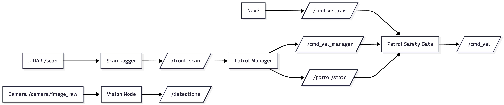
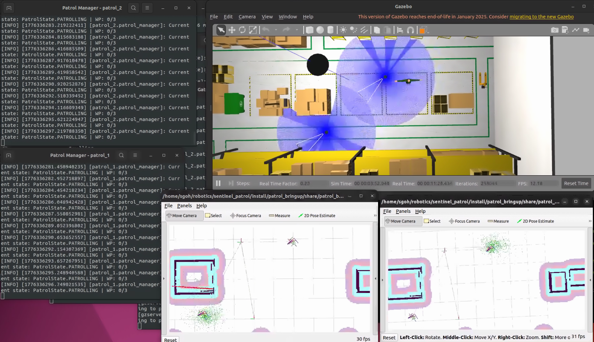
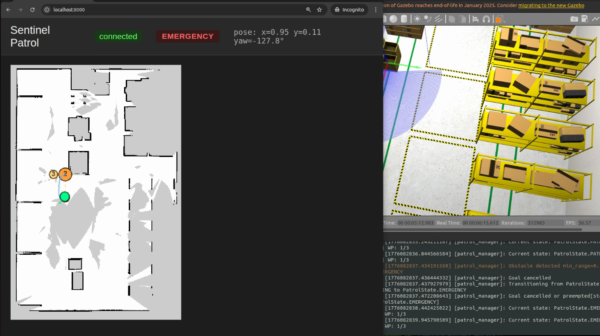
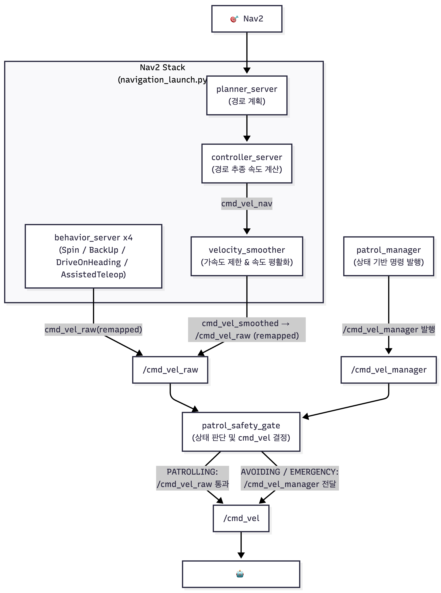
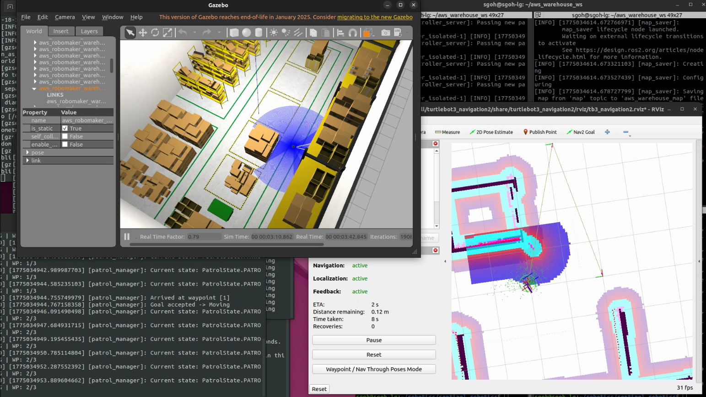
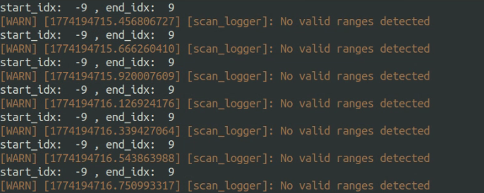

# Sentinel Patrol

ROS2/Nav2 기반 자율 순찰 로봇 시스템입니다.

단순히 목표 지점으로 이동하는 로봇 데모가 아니라, LiDAR와 카메라 입력을 바탕으로 **위험 감지**, **안전 정지**, **상태 전이**, **회피 기동**, **비전 인식**, **관제 시각화**, **멀티로봇 시뮬레이션**까지 연결한 순찰 시스템입니다.

Nav2의 주행 기능을 활용하되, 그 위에 독립적인 safety layer와 상태머신 기반 patrol manager를 얹어 실제 순찰 로봇에 필요한 예외 처리 흐름을 구현했습니다.

## 프로젝트 개요

Sentinel Patrol은 TurtleBot3/Gazebo 시뮬레이션 환경에서 순찰 로봇이 waypoint를 따라 이동하고, 장애물 위험을 감지하면 정지와 회피를 수행한 뒤 다시 순찰로 복귀하도록 만든 프로젝트입니다.

또한 YOLO 기반 사람 인식 파이프라인과 WebSocket 기반 관제 대시보드를 추가해, 로봇 내부 상태를 외부 시스템으로 확장할 수 있는 구조를 함께 검증했습니다.

AWS RoboMaker warehouse world에서는 `patrol_1`, `patrol_2` 네임스페이스로 두 대의 TurtleBot3를 동시에 띄우고, 각 로봇의 TF frame과 Nav2 파라미터를 분리해 멀티로봇 환경까지 구성했습니다.

### 목표

- Nav2 `NavigateToPose` action을 이용한 waypoint 순찰 루프 구현
- LiDAR 기반 전방 위험 판단과 독립적인 안전 정지 계층 구축
- 상태머신 기반으로 `PATROLLING`, `EMERGENCY`, `AVOIDING` 흐름 관리
- 장애물 회피 후 일정 시간 안전 상태를 확인하고 순찰로 복귀하는 avoidance 루프 구현
- YOLO 기반 person detection 결과를 ROS custom message로 발행
- ROS topic을 WebSocket으로 중계해 pose, path, waypoint, patrol state를 웹 대시보드에 시각화
- namespace, TF frame, Nav2 parameter를 분리한 Gazebo 멀티로봇 시뮬레이션 환경 구성

### 기술 스택

| 구분 | 사용 기술 |
| --- | --- |
| Robot | ROS2 Humble, Nav2 |
| Simulation | Gazebo, TurtleBot3 Waffle, AWS RoboMaker warehouse world|
| Perception | LiDAR, YOLO11, OpenCV |
| Backend | Python, FastAPI |
| Frontend | Typescript, React |

### 주요 핵심 구성

| 패키지 / 노드 | 역할 |
| --- | --- |
| `patrol_sensors/scan_logger.py` | `/scan`을 읽어 전방 최소 거리, 위험 상태, 회피 방향을 계산하고 `/front_scan`으로 발행 |
| `patrol_sensors/patrol_safety_gate.py` | Nav2의 주행 명령과 관리자 명령을 중재하여 `/cmd_vel`로 전달 |
| `patrol_manager/patrol_manager_node.py` | 순찰 상태머신, waypoint 순찰, emergency 정지, avoidance, 복귀 흐름 관리 |
| `patrol_vision/vision_node.py` | YOLO 기반 사람 검출 및 custom message 발행 |
| `patrol_msgs` | `FrontScan`, `Detection`, `Detections` 메시지 정의 |
| `patrol_bringup/multi_patrol.launch.py` | Gazebo에 `patrol_1`, `patrol_2`를 spawn하고 namespace와 TF frame을 분리 |
| `nav2_patrol_1_params_humble.yaml`, `nav2_patrol_2_params_humble.yaml` | 로봇별 AMCL, costmap, controller, behavior server frame 설정 분리 |
| `start_warehouse_multi_patrol.sh` | warehouse world, multi robot spawn, robot별 Nav2/RViz 실행 순서 자동화 |
| `fleet/backend`, `fleet/frontend` | ROS 토픽을 WebSocket으로 중계하고 지도 위에 pose, path, waypoint, 상태를 시각화 |

### 시스템 흐름

아래 이미지는 실제 노드와 토픽 연결을 한눈에 보기 쉽게 정리한 시스템 아키텍처입니다.

<p align="center">
  
</p>

## 구현 내용 요약

| 계층 | 구현한 것 | 설계 의도 및 특징 |
| --- | --- | --- |
| 센서 처리 | LaserScan의 전방 영역을 추출해 최소 거리, 위험 상태(`safe`, `caution`, `danger`), 회피 방향을 `FrontScan` 메시지로 발행 | 원시 센서 데이터를 바로 제어에 쓰지 않고, 여러 노드가 공유할 수 있는 안정적인 판단 인터페이스로 추상화 |
| 안전 제어 | Nav2 `/cmd_vel`을 `/cmd_vel_raw`로 분리하고, `patrol_safety_gate`가 상태에 따라 Nav2 명령과 관리자 정지 명령을 중재 | 기존 주행 스택을 수정하지 않고 safety layer를 추가하는 구조 설계 |
| 순찰 관리 | YAML waypoint를 순환하며 Nav2 `NavigateToPose` action goal을 보내고, 현재 waypoint와 전체 waypoint 목록을 publish | action 기반 비동기 흐름, goal cancel/retry, latched QoS를 활용한 ROS2 시스템 구성 |
| 상태머신 | `IDLE`, `PATROLLING`, `EMERGENCY`, `AVOIDING`, `RETURNING` 상태를 중심으로 순찰 흐름 제어 | 기능을 조건문으로 누적하지 않고, 상태와 전이 조건으로 로봇 행동을 관리 |
| 회피 행동 | 위험이 지속되면 순찰 goal을 취소하고, LiDAR 좌우 섹터 비교로 회피 방향을 선택한 뒤 Nav2 `Spin` action으로 90도 회전 | 단순 속도 명령이 아니라 완료 여부를 추적할 수 있는 action 기반 회피 루프 구현 |
| 안정화 로직 | 위험 진입/해제 기준을 분리하는 hysteresis margin과 safe confirm 시간을 적용 | 센서 노이즈와 경계값 진동을 상태 전이 안정성 문제로 보고 해결 |
| 비전 파이프라인 | YOLO11 기반 person detection, bbox/신뢰도/각도 정보를 담은 `Detection`, `Detections` custom message 발행 | AI 인식 결과를 단발성 출력이 아니라 ROS 메시지 파이프라인으로 연결 |
| 멀티로봇 시뮬레이션 | AWS warehouse world에서 `patrol_1`, `patrol_2`를 동시에 spawn하고, 각 로봇의 Nav2 stack을 별도 namespace와 parameter로 실행 | 단일 로봇 기능 구현을 넘어 namespace, TF, frame, Nav2 설정 충돌을 고려한 확장 환경 구성 |
| 관제 대시보드 | FastAPI backend가 ROS pose/path/state/waypoint 토픽을 WebSocket으로 전달하고, React canvas에서 지도 위에 시각화 | 로봇 내부 상태를 외부 UI로 노출하는 full-stack 확장 기반 마련 |

### 구현 화면

| 멀티로봇 waypoint 순찰 | 관제 대시보드 emergency 상태 |
| --- | --- |
|  |  |


## 설계 및 구현 상세

아래 항목은 순찰 로봇 시스템을 구성하기 위해 설계하고 구현한 주요 구조입니다.

### 1. 위험 상황에서의 Nav2 주행 명령 차단

#### 상황

Nav2 goal을 주면 로봇은 정상적으로 이동했지만, 별도의 안전 계층이 없으면 장애물 근접 상황에서 충돌 가능성이 존재했습니다.

#### 설계 판단

목표까지 이동시키는 책임과, 지금 당장 멈춰야 하는지를 판단하는 책임은 다릅니다.
즉, 순찰 시스템에는 **주행과 독립된 안전 제어 계층**이 필요했습니다.

#### 구현

- Nav2의 `/cmd_vel`을 `/cmd_vel_raw`로 remapping
- 별도로 `/cmd_vel_manager`를 두어, `EMERGENCY` 상태에서 patrol manager가 정지 명령을 보낼 수 있도록 구성
- `patrol_safety_gate`에서 현재 상태에 따라 두 명령 중 하나만 `/cmd_vel`로 전달

#### 결과

Nav2를 끄지 않고도, **주행 계층 위에 안전 계층을 하나 더 올리는 구조**를 확보했습니다.
이 덕분에 이후 상태머신과 회피 동작도 Nav2와 충돌하지 않고 붙일 수 있었습니다.

| 적용 이전 | 적용 이후 |
| --- | --- |
|  |  |

---

### 2. 순찰 동작의 상태머신 구조화

#### 상황

장애물 대응, 정지, 회피, 복귀, 대기 같은 동작이 늘어나면 단순 조건문만으로는 현재 로봇이 무엇을 하고 있는지 관리하기 어려워집니다.

#### 설계 판단

순찰은 결국 "지금 어떤 상태인지"와 "어떤 조건에서 다음 상태로 넘어가는지"가 명확해야 하는 문제입니다.
상태 정의 없이 기능만 계속 붙이면, 로직이 꼬이고 예외 상황이 늘어날수록 유지보수가 급격히 어려워집니다.

#### 구현

- `PatrolState` enum 정의
- `IDLE`, `PATROLLING`, `WAIT`, `EMERGENCY`, `AVOIDING`, `RETURNING` 상태 설계
- `/front_scan`을 입력으로 받아 상태 전이를 수행하는 `PatrolManager` 구현
- 이후 waypoint 순찰, 회피 동작, 복귀 흐름을 이 상태머신 위에 연결

#### 결과

순찰 기능을 "기능의 집합"이 아니라 **상태 전이 기반 시스템**으로 바꿨습니다.
이 구조 덕분에 이후 회피 로직과 비전 확장도 붙일 수 있는 토대를 만들었습니다.

```text
PATROLLING
  └─ danger 감지 → EMERGENCY
EMERGENCY
  └─ 5초 danger 지속 → AVOIDING
AVOIDING
  └─ Spin 완료 + 3초 safe 유지 → PATROLLING
```

<p align="center">
  
</p>

---

### 3. 순찰 로봇을 위한 비전 파이프라인 구축

#### 상황

이 프로젝트를 단순 이동 로봇이 아니라, 이후 사람 인식과 상위 행동 제어까지 확장 가능한 시스템으로 만들기 위해 vision node가 필요했습니다.

#### 설계 판단

기존 시스템은 LiDAR 기반 안전 제어에 집중되어 있었고, 카메라 기반 객체 인식 결과를 다른 ROS 노드와 공유하는 구조가 없었습니다.
또한 단순히 YOLO가 인식되는지 보는 수준이 아니라, **detection 결과를 어떤 메시지 단위로 발행할지**도 함께 설계해야 했습니다.

#### 구현

- YOLO11 테스트 환경 구축 및 person 객체 인식 실험
- `vision_node`를 구현해 `/camera/image_raw`를 입력으로 받고 `/detections` 발행
- `Detection`, `Detections` custom message 정의
- frame 단위 발행과 bbox 단위 정보를 함께 다룰 수 있도록 메시지 구조 설계
  - `Detections`: 하나의 frame에 대한 여러 bounding box 정보들
  - `Detection`: 하나의 bounding box에 대한 검출 정보
- low confidence / uncertain 케이스를 저장해, 후속 튜닝 데이터로 남기도록 구성
- AWS RoboMaker small warehouse 맵으로 환경을 확장하고 person 객체 검출 검증

#### 결과

카메라 입력 기반 객체 인식과 ROS 메시지 publish 흐름을 갖춘 비전 파이프라인을 확보했습니다.

#### 새 world map 적용(AWS Robomaker small warehouse)

<p align="center">
  
</p>

#### Person 객체 인식

<p align="center">
  
</p>

---

### 4. 멀티로봇 Gazebo 시뮬레이션 환경 구성

#### 상황

단일 로봇 순찰 기능을 검증한 뒤, 같은 world와 map 위에서 여러 로봇을 동시에 실행할 수 있는 환경이 필요했습니다.

#### 설계 판단

멀티로봇 환경에서는 각 로봇의 topic, TF frame, Nav2 parameter가 섞이지 않아야 합니다.
따라서 로봇별 namespace와 frame을 분리하고, Nav2 stack도 robot-specific parameter로 실행하도록 구성했습니다.

#### 구현

- `multi_patrol.launch.py`에서 `patrol_1`, `patrol_2` namespace로 TurtleBot3 2대 spawn
- SDF의 `odom`, `base_footprint`, `base_scan` frame을 로봇별로 수정해 TF 충돌 방지
- `nav2_patrol_1_params_humble.yaml`, `nav2_patrol_2_params_humble.yaml`로 AMCL, local/global costmap, behavior server frame 분리
- `start_warehouse_multi_patrol.sh`에서 warehouse world, multi robot spawn, robot별 Nav2/RViz 실행 순서 자동화

#### 결과

AWS RoboMaker warehouse world에서 두 대의 순찰 로봇을 동시에 띄우고, 각 로봇의 Nav2 stack을 독립적으로 실행할 수 있는 시뮬레이션 기반을 만들었습니다.

<p align="center">
  
</p>

## 문제 해결 과정

아래 항목은 구현 중 실제로 발생한 오류나 불안정한 동작을 분석하고 개선한 사례입니다.

### 1. 전방 최소 거리 계산에서의 인덱싱 문제

#### 상황

Scan Logger 노드에서 전방 범위의 최소 거리를 계산해, 이후 safety gate와 patrol manager가 공통으로 사용할 수 있는 기준 정보를 만들고자 했습니다.

#### 원인 분석

처음에는 `0 rad`를 중심으로 `±10도` 구간을 잘라 `ranges[]`에서 최소 거리를 구하도록 구현했습니다.
하지만 실제로는 `No valid ranges detected`만 반복 출력됐고, 확인 결과 전방 범위 배열 자체가 비어 있었습니다.

<p align="center">
  
</p>

문제의 원인은 **LaserScan은 원형 각도 데이터를 표현하는데, 이를 일반 리스트 슬라이싱처럼 처리한 것**이었습니다.
전방 구간이 배열의 시작점 또는 끝점을 걸치면 `start_index`가 음수가 되거나 `end_index`가 전체 길이를 넘어가면서 전방 데이터가 끊겼습니다.

#### 해결

- `angle_min`, `angle_increment`를 이용해 `0 rad` 기준 인덱스를 계산
- `±10도` 전방 윈도우를 인덱스로 변환
- 배열 경계를 넘는 경우 wrap-around 처리 추가
- `range_min < r < range_max` 조건으로 유효 거리만 필터링

#### 결과

센서 값을 가공하여 상태를 출력하는, **재사용 가능한 전방 위험 인터페이스**를 만들었습니다.
이 단계가 이후 safety gate, state machine, avoidance 로직의 출발점이 되었습니다.

<p align="center">
  
</p>

---

### 2. 정지 후 재출발이 반복되는 oscillation 문제

#### 상황

초기 safety gate에서는 위험 시, 정지 직후 다시 출발하려다 또 멈추는 oscillation이 발생했습니다.
즉, **위험 상태를 안정적으로 유지하지 못하는 시스템**이었습니다.

#### 원인 분석

속도 기반 threshold를 동적으로 사용하다 보니, 정지하면서 속도가 0에 가까워질수록 위험 판정 기준도 즉시 변했습니다.
그 결과 같은 거리 조건에서도 상태가 짧은 시간 안에 뒤집히며 진입과 해제가 반복됐습니다.

#### 해결

- 현상을 상태 전이 불안정 문제로 정의
- `hysteresis margin`을 도입해 진입 조건과 해제 조건 분리
- 정지 후 즉시 재출발하지 않도록 여유 구간 추가(10cm margin)
- 위험 상태에서 충분히 안정적으로 머무는지 반복 검증

#### 결과

장애물 근처에서 멈칫거리며 재출발하던 문제가 사라졌고, **위험 상황에서 신뢰할 수 있는 정지 동작**을 확보했습니다.

| 문제 상황 | 개선 후 |
| --- | --- |
|  |  |

---

### 3. Avoidance 동작의 무한 반복 문제

#### 상황

장애물 대응을 위해 avoidance를 넣었지만, 특정 상황에서 회피 상태를 빠져나오지 못하고 무한히 반복되는 문제가 있었습니다.

#### 원인 분석

단순히 "돌아라" 수준의 회피는 실제 공간 정보를 충분히 반영하지 못했고, 회피가 끝났는지 판단하는 기준도 불안정했습니다.
즉, 회피는 **방향 선택, 동작 완료, 순찰 복귀까지 하나의 흐름**으로 다뤄야 했습니다.

#### 해결

- LiDAR 좌우 섹터 평균 거리를 비교해 더 안전한 방향으로 회피 방향 선택
- 단순 회전 명령 대신 `Nav2 Spin Action`으로 회피 동작 구조화(90도 회전)
- 회피 완료 후 safe 상태가 3초간 유지되면 다시 `PATROLLING`으로 복귀하도록 연결
- 반복 테스트를 통해, 실제로 여러 번 순찰 재개가 가능한지 확인

#### 결과

무한 avoidance 문제가 완화되었고, **회피 후 다시 원래 임무로 복귀하는 순찰 루프**를 구현했습니다.
아직 동적 장애물이 계속 바뀌는 복잡한 환경까지 다룬 것은 아니지만, 기본 회피-복귀 구조는 확보했습니다.

#### 문제 재현


#### 개선 후


#### Nav2 Spin Action 적용


